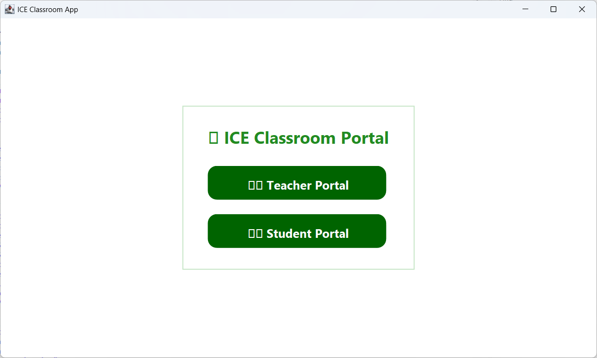
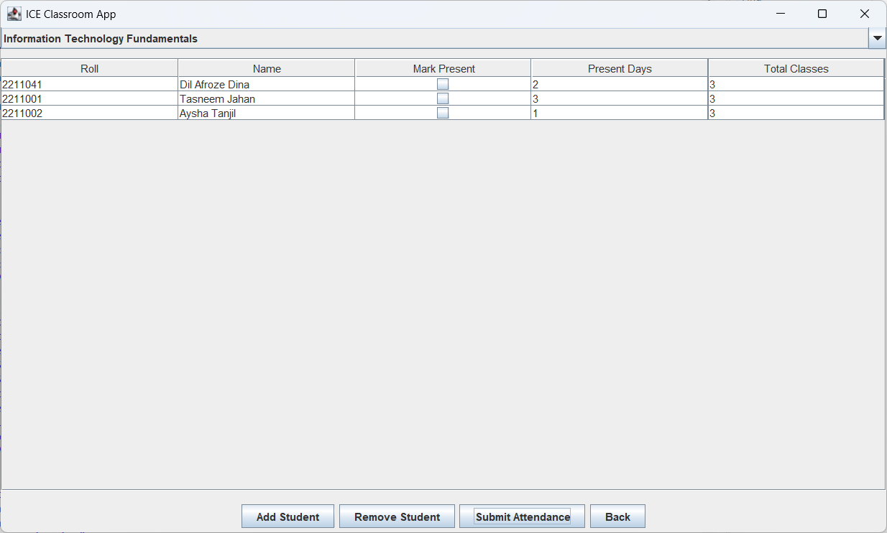
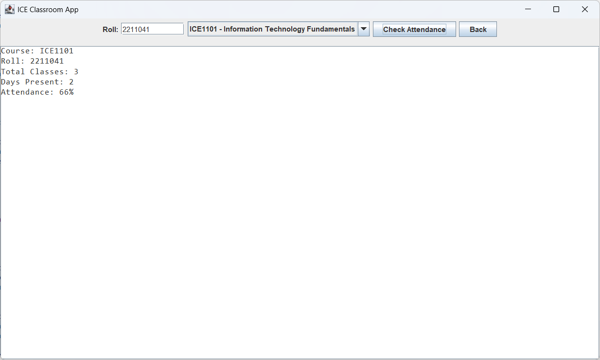

# 🌿 ICE Classroom App

A Java Swing-based classroom management system for teachers and students.

## 🎯 Features
- Teacher Portal for marking attendance  
- Student Portal for checking attendance  
- Works offline (no database needed)  
- Simple and user-friendly interface
- ## 🖼️ Project Screenshots

### 🌿 Main Page

### 👨‍🏫 Teacher Portal

### 🎓 Student Portal

GitHub: [Dina2729](https://github.com/Dina2729)
